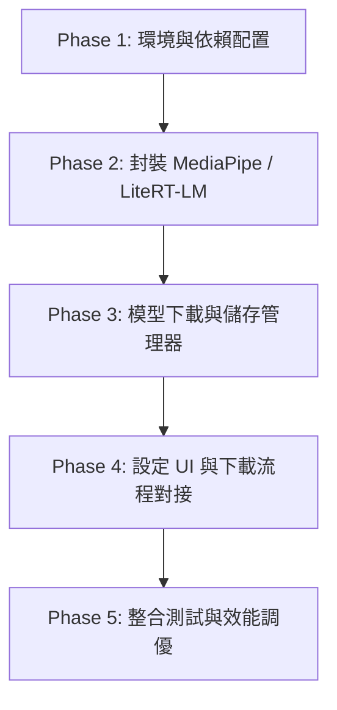

# FUTURE_TODO: MediaPipe + Gemma 2 2B 本地端 LLM 整合計劃

本文件規劃將本地端大型語言模型（Local LLM - Gemma 2 2B）整合至 ezTalk APP 中，作為 ASR 文本校正與語意解析模組的本地推論引擎。

---

## 🎯 整合目標
- **離線推論能力**：在無網路或不登入 Google 帳號（OAuth 2.0）的狀態下，依然可以使用本地 LLM 進行 ASR 糾錯與語意指令比對。
- **統一介面適配**：實現 `LlmProvider` 介面，讓 `TranscriptCorrectionModule` 和 `SpeakerSemanticModule` 無縫接入本地引擎。
- **資源負載控制**：確保在中高階 Android 設備上，Gemma 2 2B 能以流暢的 Token 生成速率運行，且不造成 App 崩潰或主執行緒卡頓。

---

## 🗺️ 實作階段規劃



### 🟩 Phase 1: 環境與依賴配置
- [ ] 於 `app/build.gradle` 中引進 MediaPipe / LiteRT-LM 的 GenAI 依賴庫。
  - 建議使用新版 LiteRT-LM：`implementation("com.google.ai.edge.litertlm:litertlm-android:<version>")`
- [ ] 設定 `AndroidManifest.xml` 的大檔案與網絡下載權限。
- [ ] 取得 `Gemma 2 2B` 的 MediaPipe/LiteRT 格式化量化模型檔（`.bin` 或 `.litertlm`）。

### 🟩 Phase 2: 封裝 MediaPipe / LiteRT-LM (`LlmProvider` 實現)
- [ ] 新建 `LocalGemmaMediapipeLlmProvider.kt` 繼承並實現 `LlmProvider` 介面。
- [ ] 包裝 MediaPipe 的 `LlmInference`（或 LiteRT-LM `Engine`）初始化流程。
  - 注意：必須將初始化置於背景執行緒（如 `Dispatchers.IO`），避免卡頓 UI。
- [ ] 將 `LlmRequest` 中的 `systemInstruction` 與 `userPrompt` 格式化為 Gemma 2 的 Prompt Template：
  ```
  <start_of_turn>user
  {systemInstruction}
  
  {userPrompt}<end_of_turn>
  <start_of_turn>model
  ```
- [ ] 實作流式生成（Stream）與單次生成解碼，回傳 `LlmResponse`。

### 🟩 Phase 3: 模型下載與儲存管理器
Gemma 2 2B 模型檔案體積巨大（INT4 約 1.3GB - 1.8GB），不可封裝於 APK 內。
- [ ] 設計 `LocalModelManager.kt` 管理模型生命週期。
- [ ] 實作下載模組（使用 Android `DownloadManager` 或 OkHttp 串流），支援斷點續傳。
- [ ] 下載完成後解壓至 `context.filesDir.absolutePath + "/models/gemma2_2b"`，並進行 MD5 雜湊校驗。
- [ ] 提供 `isModelDownloaded(): Boolean` 等狀態查詢接口。

### 🟩 Phase 4: 設定 UI 與下載流程對接
- [ ] 於進階設定頁面（Advanced Settings）新增「本地 LLM 選擇：Gemma 2 2B (MediaPipe)」。
- [ ] 當用戶選擇該選項且模型未下載時，顯示下載提示與進度條（Progress Bar）。
- [ ] 串接 `SpeakerLocalLlmStatus`，顯示下載中、下載完成、錯誤等狀態提示。

### 🟩 Phase 5: 整合測試與效能調優
- [ ] 在 `SpeakerLlmProviderFactory.kt` 中註冊新的 `LocalGemmaMediapipeLlmProvider`。
- [ ] 於 ASR 文本校正（`TranscriptCorrectionModule`）進行本地校正測試。
- [ ] 於語音指令 fallback（`SpeakerSemanticModule`）進行本地指令解析測試。
- [ ] 效能調優：
  - 調整 GPU Delegate 與 CPU Thread 數。
  - 監控推論時的 RAM 占用（Memory footprint），防止低端裝置 OOM。
  - 量測 Token/s 生成速度，調優 Temperature 與 Top-K 參數。
